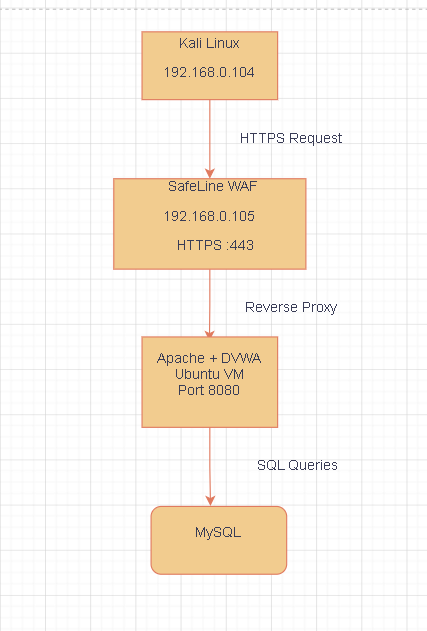
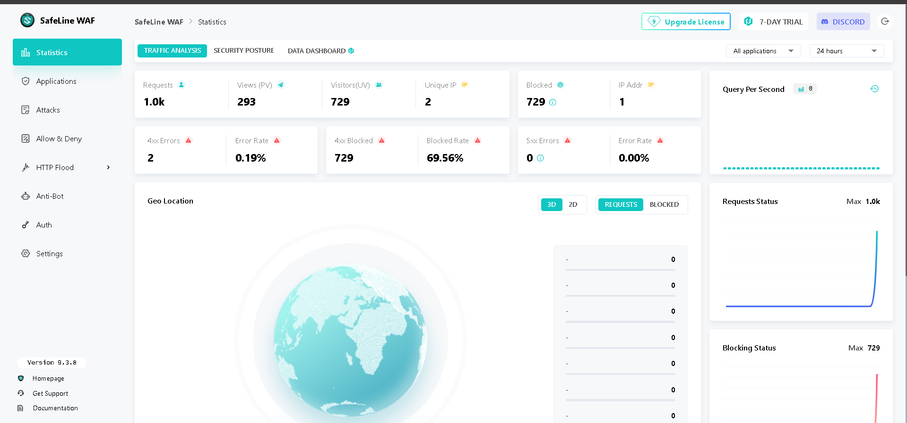
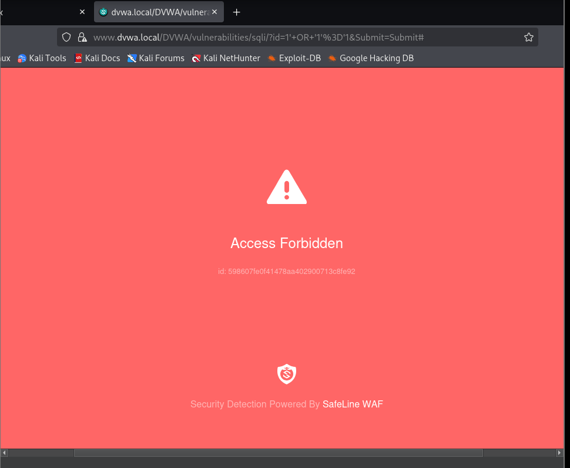
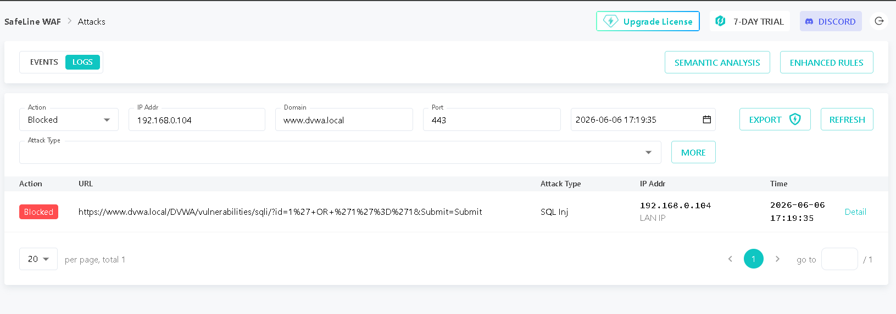
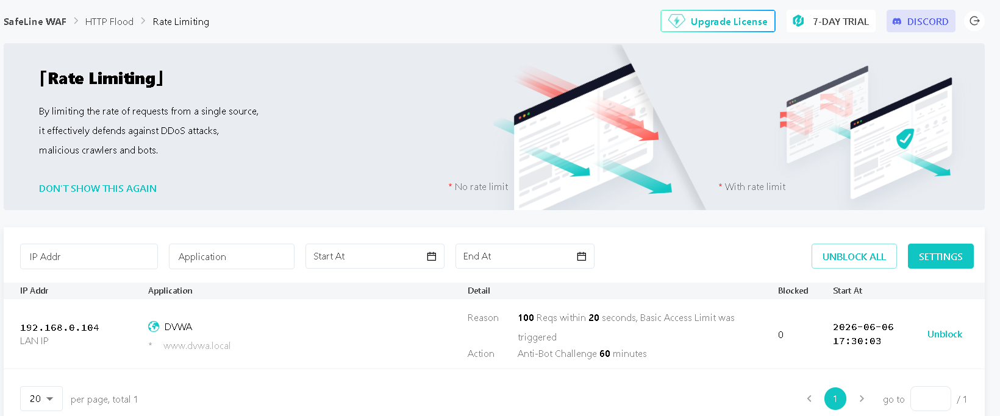
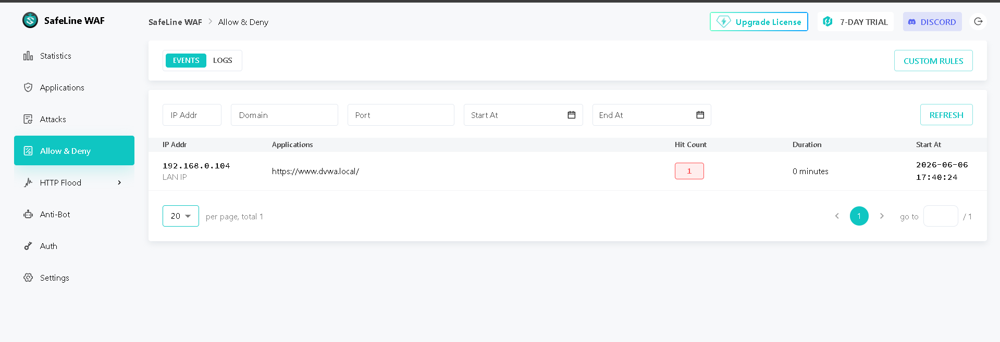
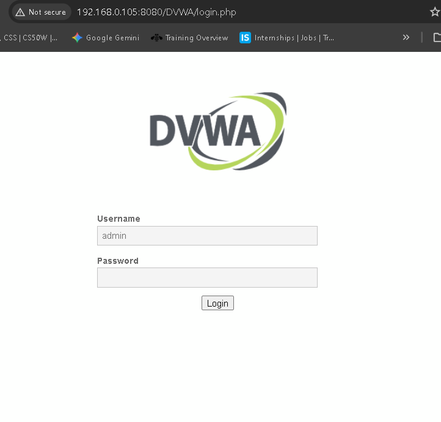

# DVWA + SafeLine WAF Cybersecurity Homelab

## Overview

This project demonstrates the deployment of **DVWA (Damn Vulnerable Web Application)** behind **SafeLine WAF** in a controlled cybersecurity homelab environment.

The objective was to simulate real-world web application attacks from an attacker machine (Kali Linux) and evaluate SafeLine WAF's ability to detect, block, and log malicious activity.

---

## Lab Environment

| Component | Purpose |
|------------|------------|
| Kali Linux | Attacker Machine |
| Ubuntu Server | Web Server |
| Apache2 | Hosts DVWA |
| DVWA | Vulnerable Web Application |
| MySQL | Backend Database |
| SafeLine WAF | Web Application Firewall |
| Docker | SafeLine Deployment |
| OpenSSL | SSL Certificate Generation |
| VirtualBox | Virtualization Platform |

---

## Network Architecture

Kali Linux sends HTTPS requests to SafeLine WAF, which acts as a reverse proxy and forwards legitimate traffic to DVWA running on Apache. DVWA communicates with the MySQL database.



---

## Implemented Features

- DVWA deployment on Ubuntu
- Apache web server configuration
- Port reconfiguration from 80 to 8080
- Local DNS resolution using hosts file
- Self-signed SSL certificate generation
- SafeLine WAF deployment using Docker
- Reverse proxy configuration
- SQL Injection detection and prevention
- HTTP Flood protection and rate limiting
- Custom deny rules for attacker IP blocking
- Security event monitoring and log analysis

---

## SafeLine WAF Dashboard

The SafeLine dashboard provides visibility into attack statistics, blocked requests, traffic analysis, and security posture.



---

## SQL Injection Detection

### Payload Tested

```sql
1' OR '1'='1
```

### Attack Attempt

The payload was submitted against DVWA's SQL Injection module.



### Detection Logs

SafeLine successfully detected the SQL Injection pattern and blocked the request before it reached the application.



---

## HTTP Flood Protection

High-volume requests were generated against DVWA to simulate a flood attack.

### Result

- SafeLine triggered Anti-Bot protection
- Rate limiting was enforced
- Excessive requests were blocked



---

## Custom Deny Rules

A custom deny rule was configured to block the Kali Linux attacker's IP address.

### Result

Traffic originating from the blocked source IP was denied successfully.



---

## DVWA Application Access

DVWA was successfully deployed behind SafeLine WAF using HTTPS.



---

## Challenges Encountered

During implementation several issues were identified and resolved:

- Docker image download timeouts during SafeLine installation
- Apache default page displayed instead of DVWA
- SSL certificate permission issues
- SafeLine backend upstream configuration errors
- Local DNS resolution and hosts file configuration
- Reverse proxy troubleshooting

### Troubleshooting Performed

- Verified Docker and Docker Compose installation
- Configured Apache to listen on port 8080
- Imported SSL certificates into SafeLine
- Updated Windows hosts file for DNS resolution
- Validated reverse proxy connectivity
- Verified attack detection through SafeLine logs

---

## Key Learnings

- Web Application Firewall deployment and management
- Reverse proxy architecture
- SSL/TLS implementation
- SQL Injection detection and prevention
- HTTP Flood and Anti-Bot protection
- Security monitoring and event analysis
- Defensive security controls in web environments

---

## Outcome

Successfully built a defensive cybersecurity homelab capable of:

- Detecting SQL Injection attacks
- Blocking malicious requests
- Enforcing rate limiting
- Restricting attacker access through deny rules
- Monitoring security events through a centralized WAF dashboard

This project demonstrates both offensive and defensive cybersecurity concepts through practical hands-on implementation.

---

## Author

**Khushi Gupta**

Cybersecurity Enthusiast | SOC Analyst Aspirant | Homelab Builder
